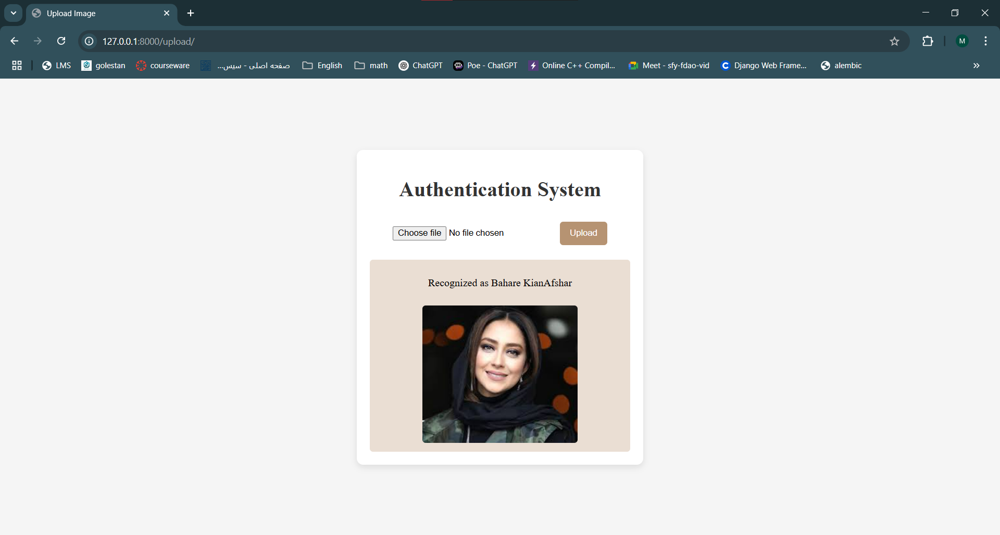

# Face Recognition System

## Overview

This project implements a **face recognition system** using two different approaches:

1. **ResNet-based Model** – A feature extraction approach using ResNet.
2. **Siamese Network** – A deep learning approach trained on the **VGGFace2 dataset** to learn facial similarity.

A **FastAPI**-based web interface was developed, allowing users to upload an image for face recognition.

---

## Methods Used

### 1. ResNet-based Face Recognition

- Utilizes **ResNet** as a feature extractor.
- Compares facial embeddings using similarity metrics.
- Efficient for real-world applications with pre-trained weights.

### 2. Siamese Network Approach

- A **Siamese neural network** trained on the **VGGFace2 dataset**.
- Learns facial similarity by minimizing the distance between embeddings of the same person.
- Capable of one-shot learning for new identities.

---

## Setup

To run the project locally, follow these steps:

### Prerequisites

Make sure you have Python 3.8+ installed.

### Run the FastAPI Server

```bash
uvicorn app:app --host 0.0.0.0 --port 8000
```

---

## Usage

Once the FastAPI server is running:

1. Open `http://127.0.0.1:8000` in your browser.
2. Upload an image using the provided **web interface**.
3. The system will process the image and return the recognition result.

### Web Interface

The system includes a **FastAPI-powered UI** using **Jinja2** templates where users can upload images for face recognition.
Uploaded images are stored in the `uploads/` directory and processed using `FaceRecognition`.

---

## Example Output

Below is a sample screenshot of the face recognition API in action:



